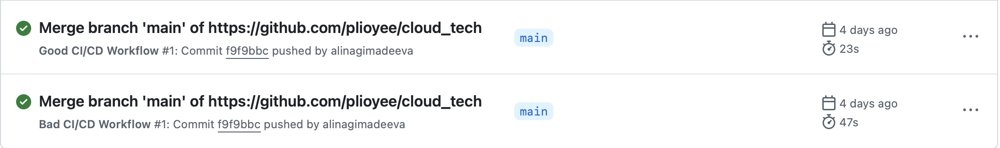
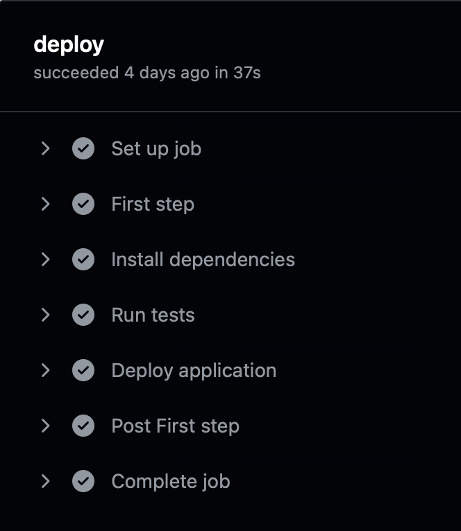
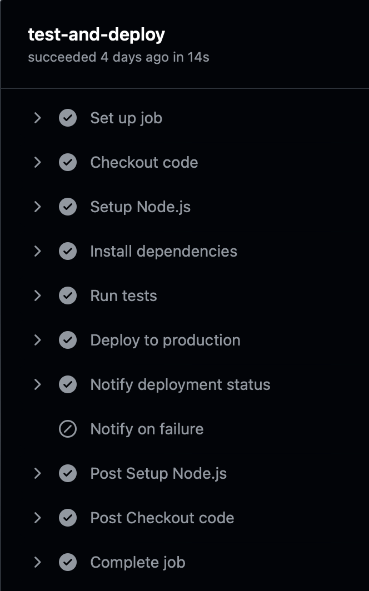

<h1>Лабораторная №4</h1>

<h2>Задание</h2>

<h3>Обычная:</h3> 
<ol>
  <li>Написать “плохой” CI/CD файл, который работает, но в нём есть не менее пяти плохих практик по написанию CI/CD</li>
  <li>Написать “хороший” CI/CD, в котором все плохие практики исправлены</li>
  <li>Указать, как были исправлены плохие практики на хорошие, сравнить полученный результат</li>
</ol>

<h2>Ход работы</h2>

<p>
Для задания был выбран GitHub Actions. С его помощью мы создали два workflow: плохой (с ошибками) и хорошенький (с исправлениями).  В качестве тестового проекта был создан простой HTML-файл и тесты для проверки наличия самого файла, а также наличия изображения.
</p>

<details>

<summary>HTML-файл</summary>

```html
<!DOCTYPE html>
<html>
 <head>
    <title>Hamster and CI/CD page</title>
    <meta charset="UTF-8">
 </head>
 <body>
    <center>
        <h1>Добро пожаловать!!!</h1>
        <p>Хомяк в контейнере:</p>
        
    </center>
 </body>
</html>
```
</details>

<details>
<summary>Тесты для HTML</summary>
  
```javascript
const fs = require('fs');

test('index.html exists', () => {
  const fileExists = fs.existsSync('./index.html');
  expect(fileExists).toBe(true);
});

test('image exists', () => {
  const imageExists = fs.existsSync('./hamster.jpg');
  expect(imageExists).toBe(true);
});
```
</details>

<h3>Плохой CI/CD</h3>
<p>
В этом файле показан плохой CI/CD, разберем bad practices из него
</p>

```yml
name: Bad CI/CD Workflow

on:
  push:
    branches:
      - '*'

jobs:
  deploy:
    runs-on: ubuntu-latest

    steps:
      - name: First step
        uses: actions/checkout@v4

      - name: Install dependencies
        run: |
          sudo apt-get update
          sudo apt-get install -y nodejs npm
          cd lab_4 && npm install

      - name: Run tests
        run: cd lab_4 && npm test || echo "Если тесты провалились, мы продолжим))"

      - name: Deploy application
        env:
          APP_SECRET: "my_super_secret"
        run: |
          echo "Деплоим..."
          echo "Задеплоили!" 
```
#### Разбор плохих практик

1. **Использование `branches: '*'` для запуска workflow.**

```yaml
on:
  push:
    branches:
      - '*'
```
   - Это считается плохой практикой, так как пайплайн будет запускаться для всех веток, включая временные или черновые, что создаст ненужную нагрузку
   - Более правильным подходом было бы запускать пайплайн только для основных веток, таких как `main` или `develop`

2. **Ненформативное название шагов.**
```yaml
    steps:
      - name: First step
        uses: actions/checkout@v4
```
   - Это сильно ухудшает читаемость workflow и увеличивает время на его анализ, название `First step` совсем не отражает суть выполняемой задачи, что именно делает этот шаг – непонятно.
     
3. **Установка Node.js вручную.**
```yaml
- name: Install dependencies
  run: |
    sudo apt-get update
    sudo apt-get install -y nodejs npm
    cd lab_4 && npm install
```
   - Вместо использования специализированного GitHub Action, такого как `actions/setup-node`, зависимости устанавливаются через `sudo apt-get`
   - Это может замедлять процесс и может создать зависимость от окружения, что приведет к устареванию версий

4. **Игнорирование провала тестов.**
```yaml
- name: Run tests
  run: cd lab_4 && npm test || echo "Если тесты провалились, мы продолжим))"
  ```
   - Если тесты проваливаются, остановка выполнения пайплайна не происходит, что приведет к деплою некорректного кода

5. **Хранение секретов как открытого текста.**
```yaml
- name: Deploy application
  env:
    APP_SECRET: "my_super_secret"
```
   - Секрет `APP_SECRET` явно прописан в коде, что делает его доступным для всех, кто имеет доступ к репозиторию, а это не очень хорошо, если данные действительно предназначены не для всех

6. **Нет уведомлений о статусе (успешного или нет) выполнения.**
```yaml
  run: |
    echo "Деплоим..."
    echo "Задеплоили!"
```
- В пайплайне отсутствуют шаги, которые информируют о статусе выполнения задач (например, успешный деплой или возникшая ошибка). Это может затруднить мониторинг CI/CD процессов, так как приходится вручную проверять лог пайплайна, чтобы понять, был ли он выполнен успешно

<h3>Хороший CI/CD</h3>
<p>
Исправленный файл с учётом хороших практик, позже расскажем расскажем почему он так хорош:
</p>

```yml
name: Good CI/CD Workflow

on:
  push:
    branches:
      - main

jobs:
  test-and-deploy:
    runs-on: ubuntu-latest

    steps:
      - name: Checkout code
        uses: actions/checkout@v4

      - name: Setup Node.js
        uses: actions/setup-node@v4
        with:
          node-version: '20'

      - name: Install dependencies
        run: npm install --prefix lab_4

      - name: Run tests
        id: test_step
        run: npm test --prefix lab_4
        continue-on-error: false

      - name: Deploy to production
        if: ${{ success() }}
        env:
          APP_SECRET: ${{ secrets.APP_SECRET }}
        run: |
          echo "Начинаем деплой..."
          echo "Успешно задеплоили!"  

      - name: Notify deployment status
        if: ${{ success() }}
        run: echo "Все гуд!"
        
      - name: Notify on failure
        if: ${{ failure() }}
        run: echo "Что-то пошло не так, проверяйте тесты!"
```
<h3>Хорошие практики в CI/CD</h3>

1. **Запуск workflow только для основной ветки.**

```yaml
on:
  push:
    branches:
      - main
```
   - Теперь Workflow запускается только для основной ветки, что снижает нагрузку на CI/CD систему, так как временные или черновые ветки игнорируются. Это также предотвращает случайные запуски пайплайна для кода, который ещё не готов к тестированию или деплою.

2. **Использование GitHub Action для настройки окружения.**
```yaml
- name: Setup Node.js
  uses: actions/setup-node@v4
  with:
    node-version: '20'
```
   - `actions/setup-node` использует актуальую версию Node.js и упрощает настройку окружения. Также устраняет зависимости от операционной системы, так как GitHub Action управляет версиями Node.js независимо.
   - Соответственно, нет необходимости вручную устанавливать зависимости, что делает процесс быстрее и надежнее.

3. **Остановка выполнения при провале тестов.**
```yaml
- name: Run tests
  id: test_step
  run: npm test --prefix lab_4
  continue-on-error: false
```
   - Если тесты провалились, то и выполнение пайплайна прекращается, предотвращая деплой некорректного кода.
   - Использование `continue-on-error: false` делает тесты обязательным этапом для завершения работы пайплайна.

4. **Использование GitHub Secrets для хранения конфиденциальных данных.**
```yaml
- name: Deploy to production
  if: ${{ success() }}
  env:
    APP_SECRET: ${{ secrets.APP_SECRET }}
  run: |
    echo "Начинаем деплой..."
    echo "Успешно задеплоили!"
```
   - GitHub Secrets позволяет безопасно хранить и использовать конфиденциальные данные, такие как токены, ключи и пароли.
Секреты не отображаются в коде или логах, что предотвращает их случайное раскрытие.
   - Это повышает безопасность проекта и защищает данные от утечек.

5. **Добавление уведомлений о статусе выполнения.**
```yaml
- name: Notify deployment status
  if: ${{ success() }}
  run: echo "Все гуд!"

- name: Notify on failure
  if: ${{ failure() }}
  run: echo "Что-то пошло не так, проверяйте тесты!"
```
   - Уведомления делают процесс CI/CD прозрачным, так как все знают, завершился ли процесс успешно или произошла ошибка.
   - Использование условий success() и failure() добавляет гибкость в обработку разных сценариев завершения workflow.

### Пайплайны
Пайплайны запускаются:



Плохой пайплайн выглядит так:



Хороший:


